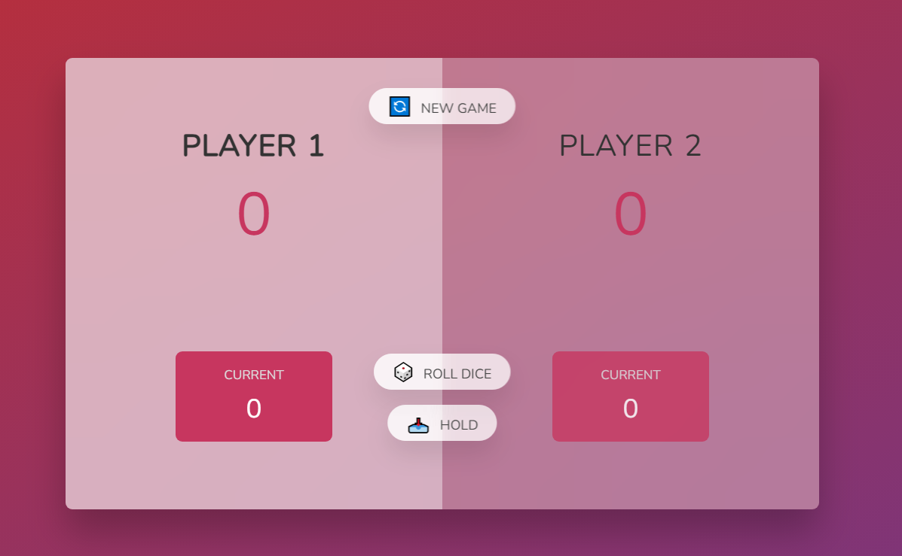

# Dice Game 🎲

A simple 2-player dice game built with **HTML**, **CSS**, and **JavaScript**. Players take turns to roll a dice and accumulate points. The first player to reach the winning score wins the game!



---

## How to Play
1. **Roll the Dice**:
   - Click on the "ROLL DICE" button to roll a dice.
   - The dice result will add to your current score unless it's a `1`, which resets your turn's score and passes the turn to the other player.

2. **Hold Your Score**:
   - Click the "HOLD" button to add your current score to your total score.
   - Once you hold, your turn ends and the other player can start rolling.

3. **Winning Condition**:
   - The first player to reach the predefined winning score wins the game!

4. **Start a New Game**:
   - Click on the "NEW GAME" button to reset the game and start over.

---

## Features
- **Dynamic Gameplay**: The game alternates turns automatically between Player 1 and Player 2.
- **Interactive UI**: Real-time updates for scores and game state.
- **Responsive Design**: Works on various screen sizes.

---

## Technologies Used
- **HTML**
- **CSS**
- **JavaScript**

---

## How to Run the Game
1. Clone this repository to your local machine:
   ```bash
   git clone https://github.com/abdulaarizaman/Pig (Dice) Game.git
